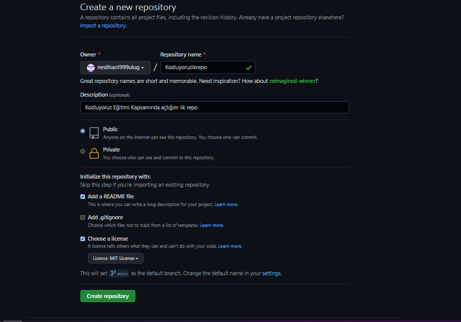

# Kodluyoruz İlk Repo
Bu Repo [Kodluyoruz](https://www.kodluyoruz.org/) Front-End WEB Development Eğitiminde oluşturduğumuz ilk repo. İçerisinde bir adet REDAME.md dosyası, bir adet de index.html barındırıyor.

## Installation
-----------------------
Öncelikle projeyi clonelayın. (Buraya sizin reponuzdan aldığınız link gelecek)
```
https://github.com/neslihan1999ulug/kodluyoruzilkrepo.git
```
## Usage
---
Projeyi cloneladıktan sonra Visual Studio Code programında açınız.

Linux için:
```
cd kodluyoruzilkrepo
code .
```
## Contributing
-----------------
Pull requestler kabul edilir. Büyük değişiklikler için, lütfen önce neyi değiştirmek istediğinizi tartışmak için bir konu açınız.
## License
------------------
[MIT](https://choosealicense.com/licenses/mit/)
